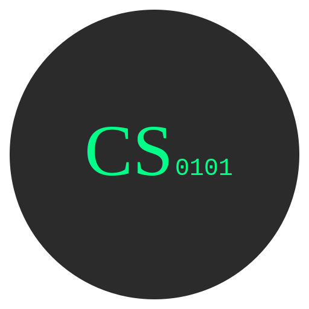

# CScript Programming Language

<p align="center">
  
</p>

CScript is a modern programming language that generates optimized machine code, designed to combine the simplicity of high-level languages with the performance of low-level optimization.

## Features

- **Optimized Machine Code Generation**: Automatically generates highly optimized machine code
- **Simple Syntax**: Intuitive and clean syntax inspired by Python and JavaScript
- **Smart Memory Management**: Efficient memory handling and optimization
- **Cross-Platform**: Works on Windows, macOS, Linux, and Replit
- **Built-in Parallelization**: Automatic parallel execution when possible

## Installation

```bash
pip install git+https://github.com/Natella404/CScript.git
```

## Quick Start

Create a file with the `.cript` extension:

```cscript
create list numbers
    store 1 2 3 4 5
--

show each in numbers
    when value > 3
        display "Large number!"
    --
--
```

Run your code:
```bash
cscript yourfile.cript
```

## Basic Syntax

### Variables and Data Types
```cscript
create number x
    store 42
--

create text greeting
    store "Hello, World!"
--
```

### Control Structures
```cscript
when x > 10
    display "Greater than 10"
--

repeat 5 times
    display "Loop iteration"
--
```

### Functions
```cscript
define action greet
    display "Hello!"
--
```

## Development

- Written in C++ with Python bindings
- Uses pybind11 for language integration
- Implements sophisticated code optimization

## Contributing

Contributions are welcome! Please feel free to submit a Pull Request.


## License

This is free and unencumbered software released into the public domain. See the UNLICENSE file for more details.

Anyone is free to copy, modify, publish, use, compile, sell, or distribute this software, for any purpose, commercial or non-commercial, and by any means.